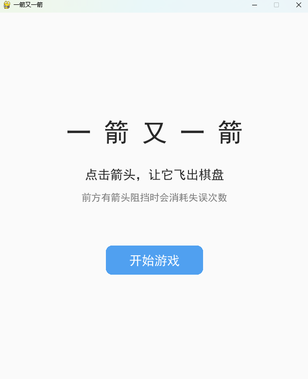
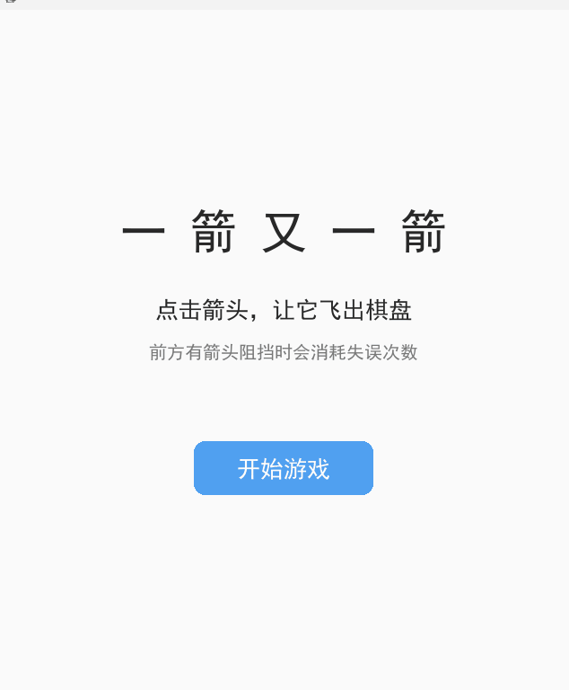
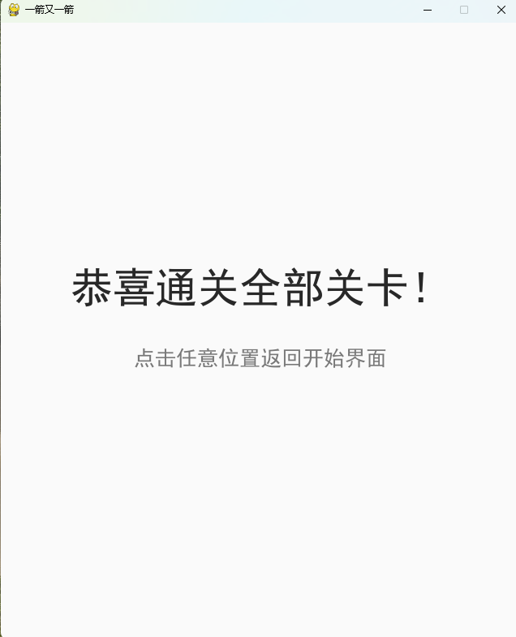

# Arrow Escape


A click-based arrow puzzle game.


## Game Rules


The board contains arrows pointing Up, Down, Left, or Right.

When you click an arrow:


- If there are no other arrows between it and the board edge in its direction, it flies out and is removed.

- If another arrow blocks its path, it cannot be removed and you lose one mistake.

- Each level allows 3 mistakes. Running out means failure.

- Clear all arrows to pass the level and advance to the next one.


## Environment


- Python 3.10

- pygame 2.5.0

- pytest (for testing only)


## Install and Run


```bash

pip install pygame

python main.py

```


## Controls


| Action | Effect |

|--------|--------|

| Left click on arrow | Flies out if unblocked; mistake +1 if blocked |

| Click Restart (top-left) | Reset current level |

| Click Start on start screen | Enter level 1 |

| Click anywhere on result screen | Back to start screen |


## Levels


3 levels total, all verified playable:


- Level 1: 4x4, 4 arrows, easy

- Level 2: 4x4, 4 arrows, simple

- Level 3: 5x5, 9 arrows, with clear-first design


## Screenshots


### Start screen




### Gameplay




### End screen




## Run Tests


```bash

python -m pytest test_game.py -v

```


## AIGC Usage


DeepSeek was used to help with the code framework, path detection and animation.

All AI-generated code has been debugged, modified and verified by the author.


## Assets


All graphics are drawn by pygame. No third-party assets.

